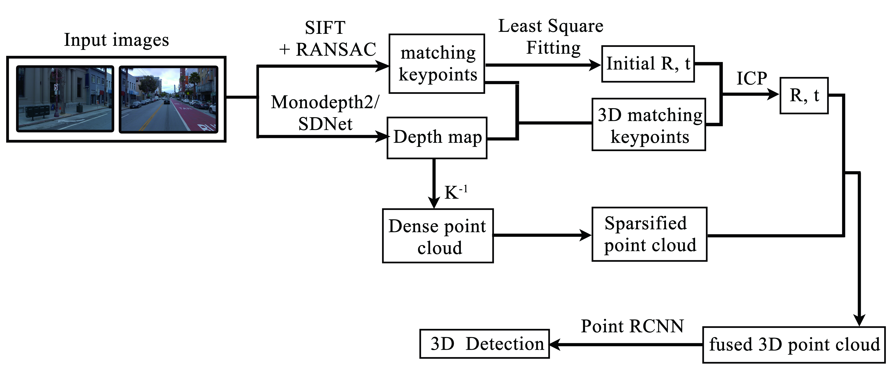
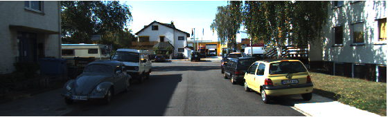
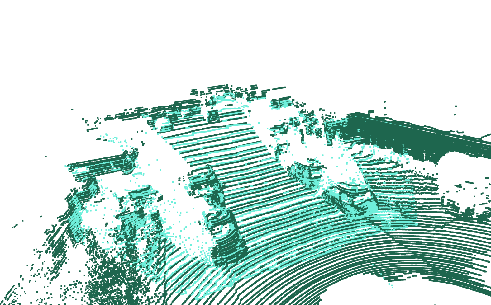
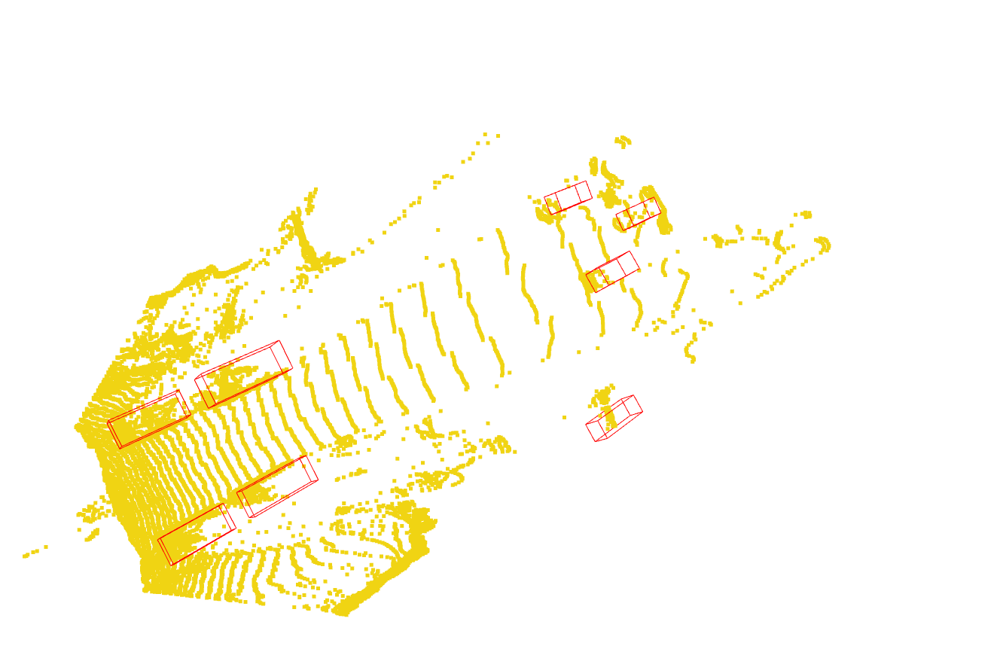
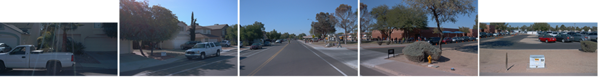
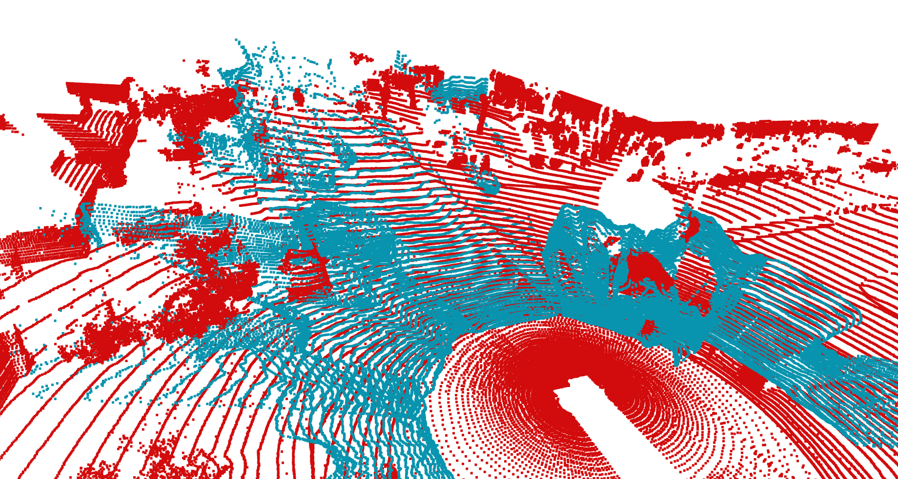
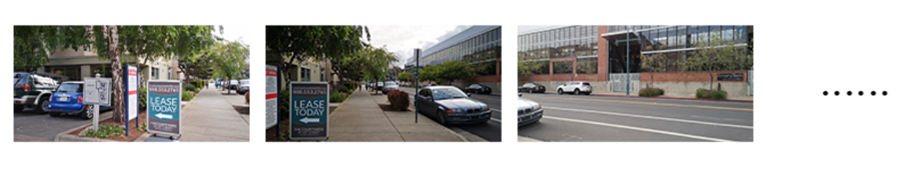
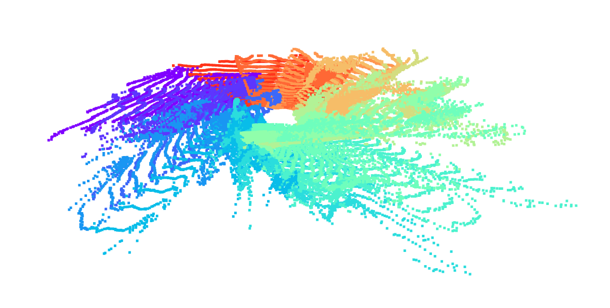
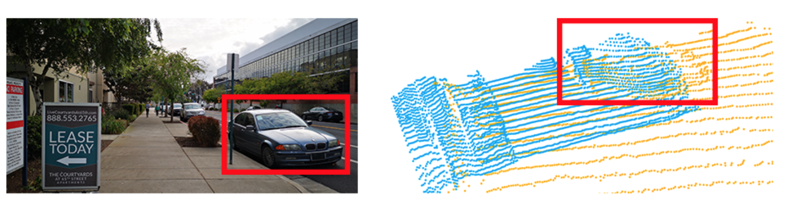

# Panorama-Pseudo-LiDAR
We presented a system to generate the panorama pseudo-LiDAR point, with multiple monocular photos taken from different orientations serving as input. In this system, we successfully recovered and sparsified the point cloud from each direction and aligned them with the transformation matrix calculated from image features.

The project can be decomposed to serval parts. 

Folder **dataset** contains the method to load data from KITTI, Waymo Open dataset and custom dataset.

Folder **src** contains the source python files for this project. In these files, we wrote API for liteflow, PointRCNN, Monodepth2 and Realsense camera.
### Framework
The whole pipeline is shown in the figure.


### Test on KITTI and Waymo

```bash
python main.py
```
### Collect data from Realsense camera

```bash
python bino_api.py
```

### Visualize results

```bash
python open3d_utils.py
```

### Results

#### KITTI

Source images:



Point cloud recovered from setero images and comparison with ground truth LiDAR points.



Detection results



#### Waymo

Source images:



Panorama point clouds recovered from five images with monodepth2 as depth prediction model.




#### Custom data

Source images:



Fusion result:



ICP fusion results details:

